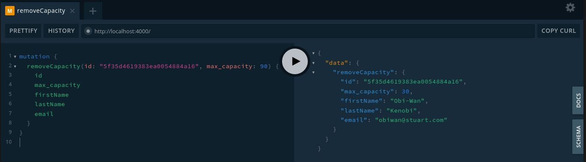

# Stuart - API 


This README.md file shows step by step how to install and run The Stuart API.

## Stack:

- Apollo Server
- GraphQL
- Node.js
- MongoDB
- Docker
- Docker Compose 

## Requirements:

There are two (2) different methods to install and run this app:

  1. **Docker way:** Using Docker pre-built images with docker-compose **(RECOMENDED!!! If you feel comfortable with Docker this way is more quickly, straightforward and less painful)**
  2. **Localhost way:** Bare metal install, first you should install and set-up all the stack on your  host (Node.js, npm, MongoDB, dependencies) before to being able to run the API.

## Instalation method #1  - Docker way: 

### Server requirements for method 1 (docker way):

You should first install

- Docker >= 19.03.12
- Docker-compose >= 1.26.2

### Cloning the repository from Github:

```
# git clone https://github.com/lacroixDj/stuart-api.git
# cd stuart-api/
```
### App & .Env Setup (Docker way):

We need proceed to configure our ENV variables in order to connect the app with our MongoDB **STUART-API-DB**:

- Use .env.example  template file as starting point, the app works well with the defaults values provided.

```
# cp .env.example .env 
```

### Build & Run docker services containers

If you have already the docker environment installed and running, and also you have cloned the repo, run the following commands inside the project folder:

```
# sudo docker-compose up --build -d db_mongo api_graphql 
```

Wait until the build process get completed.
Once the build images has been completed, then containers will run in detached (-d) mode.

If everything is OK, at the end you should see an output similar tho this:

```
...
> Creating network "stuart-api_apinetwork" with driver "bridge"
> Creating stuart-api_db_mongo_1 ... done
> Creating stuart-api_api_graphql_1 ... done
```

That's it! ;) pretty easy... Isn't it? (that's the reason people love docker) 

If you succeed in the docker way, then skip the following steps and jump over the usage instructions - Yes! Skip and Take me to [Using the API](#Using the API):

## Instalation method #2  - Localhost way: 

### Server requirements for method 2 (directly in your host):

You must install:

- Node.js ^12.xx.xx (LTS version)
- npm ^6.xx.xx (LTS version including with node)
- MongoDB ^4.xx.xx  (LTS Community version)

### Setup and enabling Authentication on MongoDB:

Once you have installed all the required environment, we must secure MongoDB connection, following the next steps:

- Connect to your **MongoDB** instance:
```
$ mongo --host localhost --port 27017 
```

- Switch to the **admin** Database:
```
> use admin; 
```

- Create the user administrator, lets call him **root**. 
- Change example **pwd** by your own secure password or leave it as it by default.
- Save the credential in a secure place. 
```
> db.createUser(
  {
    user: "root",
    pwd: "myR0o7sUp3rS3CUreP4ssW0rd.",
    roles: [ { role: "userAdminAnyDatabase", db: "admin" }, "readWriteAnyDatabase" ]
  }
)
```

- Shut down the **mongod** instance. For example, from the mongo shell, run the following command:
```
> db.adminCommand( { shutdown: 1 } ) 
```

- Disconnect from the mongo shell, you can also pess **(CTRL+D)** or **(CTRL+C)**:
```
> exit 
```

- Re-start the **MongoDB** instance with access control:
- **Troubleshooting:** in some cases you must run the command  as sudo or administrator.
```
$ mongod --auth --port 27017  --dbpath "<path to data directory>" 
```

- Connect and authenticate as the user administrator **root**:
- Enter the **root** password when prompted (or your own password if you have changed it): **myR0o7sUp3rS3CUreP4ssW0rd** 
```
$ mongo --port 27017 -u "root" --authenticationDatabase "admin" -p 
```

- Create limited user **"stuart_db_user"** needed for **"STUART-API-DB"** database. 
- Change example **"xyz123"** by your own secure password or leave it as it by default. 
- Take note of this password because we will use it later.
```
> use API-CRM-DB
> db.createUser(
  {
    user: "stuart_db_user",
    pwd: "xyz123",
    roles: [ { role: "readWrite", db: "STUART-API-DB" }]
  }
) 
```
- After creating the **stuart_db_user**, disconnect from the mongo shell.

- Test the new created user by connecting and authenticate as **stuart_db_user**:
- Enter the **stuart_db_user** password when prompted (or your own password if you have changed it): **xyz123**
```
$ mongo --port 27017 -u "stuart_db_user" --authenticationDatabase "STUART-API-DB" -p
```

- Let's insert a test document as **stuart_db_user**:
```
> use STUART-API-DB
> db.test.insert( { msg: "hello world"} )
```
- If everything went **OK**, you should see the following message:
```
> WriteResult({ "nInserted" : 1 })
```
- **Great!** We have done with the intial **MongoDB** setup, you can disconnect from the mongo shell.

### Cloning the repository from Github:

```
# git clone https://github.com/lacroixDj/stuart-api.git
# cd stuart-api/
```

### App & .Env Setup (Localhost way):

We need proceed to configure our ENV variables in order to connect the app with our  MongoDB **STUART-API-DB**:

- Use .env.example  template file as starting point, teh app works well with the defaults values provided, with some exceptions

```
# cp .env.example .env 
```

- Due we are running the app withour Docker Change the value **DOCKER_SETUP=true** to -> **DOCKER_SETUP=false**

- You also will need  to change the value of **MONGO_HOST=db_mongo** to -> **MONGO_HOST=localhost** 

Now we need to install  the app dependecies using **npm install**:

```
# cd api-graphql/
# npm install 
```

Once the app is installed lets run our API ;)! 

```
# npm start 
```
#
# Using the API:

Whatever the installation method was chosen if everything went **OK**  then we could be able to explore our API

## GraphQL Playground (API Explorer):

### Features

- Syntax highlighting.
- Intelligent type ahead of fields, arguments, types, and more.
- Real-time error highlighting and reporting for queries and variables.
- Automatic query and variables completion.
- Automatically adds required fields to queries.
- Documentation explorer, search, with markdown support.
- Query History using local storage
- Run and inspect query results using _any_ promise that resolves JSON results. HTTPS or WSS not required.
- Supports full GraphQL Language Specification.
- Queries, Mutations, Subscriptions, etc

## API "Main" Methods:

### Create Courier: inserting a new Courier into the DB

First of all, we must create at least one **Courier** to be able to use the rest of the available methods.

Let's see below the simplest way to create a Courier, **according to the functional requirements** it was only necessary to specify the **max_capcaity** field, our API will return the ID of the created courier:

**Mutation request:**
```
mutation {
  createCourier(courier: { max_capacity: 125 }) {
    id
    max_capacity
  }
}
```

**API response:**
```
{
  "data": {
    "createCourier": {
      "id": "5f35d12d9383ea0054884a15",
      "max_capacity": 125
    }
  }
}
```

**CURL Snippet:**
```
curl 'http://localhost:4000/' -H 'Accept-Encoding: gzip, deflate, br' -H 'Content-Type: application/json' -H 'Accept: application/json' -H 'Connection: keep-alive' -H 'DNT: 1' -H 'Origin: http://localhost:4000' --data-binary '{"query":"mutation {\n  createCourier(courier: { max_capacity: 125 }) {\n    id\n    max_capacity    \n  }\n}\n"}' --compressed
```

When creating a new Courier **we can also define a series of optional fields** in case we need more information, let's see an example:

**Mutation request:**
```
mutation {
    createCourier(
        courier: {
            max_capacity: 30
            firstName: "Obi-Wan"
            lastName: "Kenobi"
            email: "obiwan@stuart.com"
            active: true
            position: { lat: 41.395882, lng: 2.162983 }
        }
    ) {
        id
        max_capacity
        firstName
        lastName
        email
        active
        position {
            lat
            lng
        }
    }
}
```

**API response:**
```
{
    "data": {
        "createCourier": {
            "id": "5f35d4619383ea0054884a16",
            "max_capacity": 30,
            "firstName": "Obi-Wan",
            "lastName": "Kenobi",
            "email": "obiwan@stuart.com",
            "active": true,
            "position": {
                "lat": 41.395882,
                "lng": 2.162983
            }
        }
    }
}
```
Let's see how it Looks in **GraphQL Playground:**


**CURL Snippet:**
```
curl 'http://localhost:4000/' -H 'Accept-Encoding: gzip, deflate, br' -H 'Content-Type: application/json' -H 'Accept: application/json' -H 'Connection: keep-alive' -H 'DNT: 1' -H 'Origin: http://localhost:4000' --data-binary '{"query":"mutation {\n  createCourier(\n    courier: {\n      max_capacity: 30\n      firstName: \"Obi-Wan\"\n      lastName: \"Kenobi\"\n      email: \"obiwan@stuart.com\"\n      active: true\n      position: { lat: 41.395882, lng: 2.162983 }\n    }\n  ) {\n    id\n    max_capacity\n    firstName\n    lastName\n    email\n    active\n    position {\n      lat\n      lng\n    }\n  }\n}\n"}' --compressed
```

We have taken the initiative to include additional fields that we think may be useful for the future, such: 
- **firstName:** courier first name 
- **lastName:**  courier last name
- **email:**  courier email address
- **active:** this field that tells us wheter the courier is on duty or is not available a this time.
- **position { lat, lng } :** this field  represents the **current Courier's position expressed in geographical coordinates**, this field will help us later to query for the couries closest to a specific location/point (see advanced methods)


### Set Capacity: update a Courier Capacity

This method simply updates / overwrites the **max_capacity** field according to the indicated value, for a given Courier. It receives as parameters the  Courier's **id**  and the **max_capacity** value.

**Mutation request:**
```
mutation {
  setCapacity(id: "5f35d4619383ea0054884a16", max_capacity: 74) {
    id
    max_capacity
    firstName
  }
}
```

**API response:**
```
{
  "data": {
    "setCapacity": {
      "id": "5f35d4619383ea0054884a16",
      "max_capacity": 74,
      "firstName": "Obi-Wan"
    }
  }
}
```

**CURL Snippet:**
```
curl 'http://localhost:4000/' -H 'Accept-Encoding: gzip, deflate, br' -H 'Content-Type: application/json' -H 'Accept: application/json' -H 'Connection: keep-alive' -H 'DNT: 1' -H 'Origin: http://localhost:4000' --data-binary '{"query":"mutation {\n  setCapacity(id: \"5f35d4619383ea0054884a16\", max_capacity: 74) {\n    id\n    max_capacity\n    firstName\n  }\n}\n"}' --compressed
```

Let's see how it Looks in **GraphQL Playground:**


**Important Note:** 

In most queries, the response is a **Courier object** whose only required fields are **ID** and **max_capacity**, fields that will always be returned in queries responses.
However, as we could see in the previous examples, we can request the additional fields if we wish, this applies to almost all the methods of the API.

### Add Capacity: increasing a Courier Capacity

This method is used only **to increase in N lts. the max_capacity field value**, for a specific courier according to ID provided. It is works under the following logic **max_capacity + = new_value**.  It receives as parameters the  Courier's **id**  and the **max_capacity (increment)** value.

Taking as an example our courier **"Obi-wan Kenobi"** whose previous maximum capacity was **74 liters**, let's increase its capacity to **120 liters** for example:

**Mutation request:**
```
mutation {
  addCapacity(id: "5f35d4619383ea0054884a16", max_capacity: 46) {
    id
    max_capacity
    firstName
    lastName
    email
  }
}
```

**API response:**
```
{
  "data": {
    "addCapacity": {
      "id": "5f35d4619383ea0054884a16",
      "max_capacity": 120,
      "firstName": "Obi-Wan",
      "lastName": "Kenobi",
      "email": "obiwan@stuart.com"
    }
  }
}
```

**CURL Snippet:**
```
curl 'http://localhost:4000/' -H 'Accept-Encoding: gzip, deflate, br' -H 'Content-Type: application/json' -H 'Accept: application/json' -H 'Connection: keep-alive' -H 'DNT: 1' -H 'Origin: http://localhost:4000' --data-binary '{"query":"mutation {\n  addCapacity(id: \"5f35d4619383ea0054884a16\", max_capacity: 46) {\n    id\n    max_capacity\n    firstName\n    lastName\n    email\n  }\n}\n"}' --compressed
```

Let's see how it Looks in **GraphQL Playground:**


### Remove Capacity: decreasing a Courier Capacity

Basically it **is the opposite of the addCapacity method** explained above, it receives the same parameters but instead of increasing the capacity of the courier it decreases it. It is works under the following logic **max_capacity -= new_value**.

Following the same example of our messenger **"Obi-wan Kenobi"** to which we had previously increased the maximum capacity to **120 liters**, let's reduce this capacity to about **30 liters** for example:


**Mutation request:**
```
mutation {
  removeCapacity(id: "5f35d4619383ea0054884a16", max_capacity: 90) {
    id
    max_capacity
    firstName
    lastName
    email
  }
}
```

**API response:**
```
{
  "data": {
    "removeCapacity": {
      "id": "5f35d4619383ea0054884a16",
      "max_capacity": 30,
      "firstName": "Obi-Wan",
      "lastName": "Kenobi",
      "email": "obiwan@stuart.com"
    }
  }
}
```

**CURL Snippet:**
```
curl 'http://localhost:4000/' -H 'Accept-Encoding: gzip, deflate, br' -H 'Content-Type: application/json' -H 'Accept: application/json' -H 'Connection: keep-alive' -H 'DNT: 1' -H 'Origin: http://localhost:4000' --data-binary '{"query":"mutation {\n  removeCapacity(id: \"5f35d4619383ea0054884a16\", max_capacity: 90) {\n    id\n    max_capacity\n    firstName\n    lastName\n    email\n  }\n}\n"}' --compressed
```

Let's see how it Looks in **GraphQL Playground:**




### Get Couriers By Capacity: consulting the list of Couriers by Max Capacity

This method allows you to **consult the list of Couriers whose capacity is greater or equal to the one required**. The Dispatcher should use this Method to find out which couriers do have available space.

**Query request:**
```
{
  getCouriersByCapacity(capacity_required: 35) {
    id
    max_capacity
    firstName
    lastName
    email
    active
    position {
      lat
      lng
    }
  }
}
```

**API response:**
```
{
  "data": {
    "getCouriersByCapacity": [
      {
        "id": "5f35ef8eec743a0062c051d9",
        "max_capacity": 40,
        "firstName": "Han",
        "lastName": "Solo",
        "email": "hansolo@stuart.com",
        "active": true,
        "position": {
          "lat": 41.396713,
          "lng": 2.16411
        }
      },
      {
        "id": "5f35efadec743a0062c051db",
        "max_capacity": 50,
        "firstName": "Chewbacca",
        "lastName": null,
        "email": "chewbacca@stuart.com",
        "active": true,
        "position": {
          "lat": 41.396706,
          "lng": 2.161829
        }
      }
    ]
  }
}
```

**CURL Snippet:**
```
curl 'http://localhost:4000/' -H 'Accept-Encoding: gzip, deflate, br' -H 'Content-Type: application/json' -H 'Accept: application/json' -H 'Connection: keep-alive' -H 'DNT: 1' -H 'Origin: http://localhost:4000' --data-binary '{"query":"{\n  getCouriersByCapacity(capacity_required: 35) {\n    id\n    max_capacity\n    firstName\n    lastName\n    email\n    active\n    position {\n      lat\n      lng\n    }\n  }\n}\n"}' --compressed
```

Let's see how it Looks in **GraphQL Playground:**


### Get Couriers By Capacity and Proximity: consulting the list of Couriers which are closer to certain location with the necessary capacity, using radial search by geolocation.

Consult the list of available couriers whose capacity is greater than or equal to that required, but also **whose geographical location is within a radius expressed in meters in relation to the coordinates of a specific reference point**.

In summary, it is similar to the previous method but also **incorporates radial search by geolocation**, taking advantage of the **GIS functionalities** provided by MongoDB and Mongoose.

This method can be very useful so that Dispatchers can know in real time **which Couriers are closer to their location with the necessary capacity**. It would combine wonderfully with a Map library such as **MapBox, Leaflet or GoogleMaps** on the front-end side in a (mobile or web) client App. 

It takes as a parameter the **required capacity**, the **reference coordinates** and a **radius** expressed in meters.

#### Let's do three tests:

- first let's search within a **200 meter radius**
- then let's search within a radius of **300 meters**
- finally let's search in a **radius of 1Km**
- We will use the **geographic coordinates of Stuart's offices in Barcelona (Carrer de Pau Claris, 186) as a reference**  ;):
- Reference point: **{lat: 41.3964769, lng: 2.1604493}**  

**1 - First search 200 mts - Query request:**

```
{
  getCouriersByCapacityAndProximity(
    capacity_required: 10
    position: { lat: 41.3964769, lng: 2.1604493 }
    radius: 200
  ) {
    id
    max_capacity
    firstName
    lastName
    email
    position {
      lat
      lng
    }
  }
}
```

**API response:**
```
{
  "data": {
    "getCouriersByCapacityAndProximity": [
      {
        "id": "5f35efadec743a0062c051db",
        "max_capacity": 50,
        "firstName": "Chewbacca",
        "lastName": null,
        "email": "chewbacca@stuart.com",
        "position": {
          "lat": 41.396706,
          "lng": 2.161829
        }
      }
    ]
  }
}
```

**CURL Snippet:**
```
curl 'http://localhost:4000/' -H 'Accept-Encoding: gzip, deflate, br' -H 'Content-Type: application/json' -H 'Accept: application/json' -H 'Connection: keep-alive' -H 'DNT: 1' -H 'Origin: http://localhost:4000' --data-binary '{"query":"{\n  getCouriersByCapacityAndProximity(\n    capacity_required: 10\n    position: { lat: 41.3964769, lng: 2.1604493 }\n    radius: 200\n  ) {\n    id\n    max_capacity\n    firstName\n    lastName\n    email\n    position {\n      lat\n      lng\n    }\n  }\n}\n"}' --compressed
```

Let's see how it Looks in **GraphQL Playground:**


**2 - Second search 300 mts - Query request:**


**3 - Third search 1Km (1000) mts - Query request:** (We ask for fewer fields)


### Get Courier By Id: look for a Courier by the unique ID: 

**Query request:**
```
{
  getCourierById(id: "5f35ef2aec743a0062c051d5"){
    id
    max_capacity
    firstName
    lastName
    email
    active
    position {
      lat
      lng
    }    
  } 
}
```

**API response:**
```
{
  "data": {
    "getCourierById": {
      "id": "5f35ef2aec743a0062c051d5",
      "max_capacity": 10,
      "firstName": "Luke",
      "lastName": "Skywalker",
      "email": "luke@stuart.com",
      "active": true,
      "position": {
        "lat": 41.397532,
        "lng": 2.163488
      }
    }
  }
}
```

**CURL Snippet:**
```
curl 'http://localhost:4000/' -H 'Accept-Encoding: gzip, deflate, br' -H 'Content-Type: application/json' -H 'Accept: application/json' -H 'Connection: keep-alive' -H 'DNT: 1' -H 'Origin: http://localhost:4000' --data-binary '{"query":"{\n  getCourierById(id: \"5f35ef2aec743a0062c051d5\"){\n    id\n    max_capacity\n    firstName\n    lastName\n    email\n    active\n    position {\n      lat\n      lng\n    }    \n  } \n}"}' --compressed
```

Let's see how it Looks in **GraphQL Playground:**


### Get All Couriers: Fetch all couriers in the DB 

**Query request:**
```
{
  getAllCouriers {
    id
    max_capacity
    firstName
    lastName
  }
}
```

**API response:**
```
{
  "data": {
    "getAllCouriers": [
      {
        "id": "5f35d4619383ea0054884a16",
        "max_capacity": 30,
        "firstName": "Obi-Wan",
        "lastName": "Kenobi"
      },
      {
        "id": "5f35ef2aec743a0062c051d5",
        "max_capacity": 10,
        "firstName": "Luke",
        "lastName": "Skywalker"
      },
      {
        "id": "5f35ef58ec743a0062c051d7",
        "max_capacity": 20,
        "firstName": "Anakin",
        "lastName": "Skywalker"
      },
      {
        "id": "5f35ef8eec743a0062c051d9",
        "max_capacity": 40,
        "firstName": "Han",
        "lastName": "Solo"
      },
      {
        "id": "5f35efadec743a0062c051db",
        "max_capacity": 50,
        "firstName": "Chewbacca",
        "lastName": null
      }
    ]
  }
}
```

**CURL Snippet:**
```
curl 'http://localhost:4000/' -H 'Accept-Encoding: gzip, deflate, br' -H 'Content-Type: application/json' -H 'Accept: application/json' -H 'Connection: keep-alive' -H 'DNT: 1' -H 'Origin: http://localhost:4000' --data-binary '{"query":"{\n  getAllCouriers {\n    id\n    max_capacity\n    firstName\n    lastName\n  }\n}\n"}' --compressed
```

Let's see how it Looks in **GraphQL Playground:**


### Update Courier: Updates the courier attributes in the DB 

Anakin seems to have been feeling very upset lately,  Let's give him a hand and turn him to the dark side to become Darth Vader ;)

**Mutation request:**
```
mutation {
    updateCourier(
      	id:"5f35ef58ec743a0062c051d7",
        courier: {
            max_capacity: 30
            firstName: "Darth"
            lastName: "Vader"
            email: "darthvader@stuart.com"
            active: true
            position: { lat: 41.395882, lng: 2.162983 }
        }
    ) {
        id
        max_capacity
        firstName
        lastName
        email
        active
        position {
            lat
            lng
        }
    }
}
```

**API response:**
```
{
  "data": {
    "updateCourier": {
      "id": "5f35ef58ec743a0062c051d7",
      "max_capacity": 30,
      "firstName": "Darth",
      "lastName": "Vader",
      "email": "darthvader@stuart.com",
      "active": true,
      "position": {
        "lat": 41.395882,
        "lng": 2.162983
      }
    }
  }
}
```

**CURL Snippet:**
```
curl 'http://localhost:4000/' -H 'Accept-Encoding: gzip, deflate, br' -H 'Content-Type: application/json' -H 'Accept: application/json' -H 'Connection: keep-alive' -H 'DNT: 1' -H 'Origin: http://localhost:4000' --data-binary '{"query":"mutation {\n    updateCourier(\n      \tid:\"5f35ef58ec743a0062c051d7\",\n        courier: {\n            max_capacity: 30\n            firstName: \"Darth\"\n            lastName: \"Vader\"\n            email: \"darthvader@stuart.com\"\n            active: true\n            position: { lat: 41.395882, lng: 2.162983 }\n        }\n    ) {\n        id\n        max_capacity\n        firstName\n        lastName\n        email\n        active\n        position {\n            lat\n            lng\n        }\n    }\n}"}' --compressed
```

Let's see how it Looks in **GraphQL Playground:**


### Delete Courier: Remove a Courier from the DB 

Kylo ren killed his father, (unforgivable, don't you think? ... wait a moment Luke did the same!). Well, it's time to say goodbye to the legendary Han Solo (we'll miss you Han). 

Speaking seriously, let's see how we remove a courier

**Mutation request:**
```
mutation {
  deleteCourier(id: "5f35ef58ec743a0062c051d7") {
    status
    message
  }
}
```

**API response:**
```
{
  "data": {
    "deleteCourier": {
      "status": 200,
      "message": "SUCCESS! - The courier with the id: 5f35ef58ec743a0062c051d7 was deleted!"
    }
  }
}
```

**CURL Snippet:**
```
curl 'http://localhost:4000/' -H 'Accept-Encoding: gzip, deflate, br' -H 'Content-Type: application/json' -H 'Accept: application/json' -H 'Connection: keep-alive' -H 'DNT: 1' -H 'Origin: http://localhost:4000' --data-binary '{"query":"mutation {\n  deleteCourier(id: \"5f35ef58ec743a0062c051d7\") {\n    status\n    message\n  }\n}\n"}' --compressed
```

Let's see how it Looks in **GraphQL Playground:**


## Directory structure and source code organization:

The source code is organized as follows:


```
stuart-api/
│
├── api-graphql/
│   ├── lib/
|   |   ├── common/
|   |   |    └── utils.js         
|   |   ├── config/
|   |   |    └── db_conector.js
|   |   ├── data/
|   |   |    └── couriers-sample-data.json
|   |   ├── models/
|   |   |    └── courier-model.js
|   |   ├── services/
|   |   |    └── courier-service.js
|   |   ├── resolvers.js
|   |   └── schema.js
│   ├── node_modules/
│   ├── index.js
│   ├── package-lock.json
|   └── package.json  
│
├── assets/
├── db/
│   ├── data/
│   └── initdb-scripts/
|       ├── 0-init-mongo-user.sh
|       └── 1-test-init-mongo-db.sh 
|
|── .dockerignore
├── .env
├── .env.example
├── .gitignore
├── docker-compose.yml
├── LICENSE
└── README.md
```

## Things to improve (Future Versions):

- **Implement an authentication mechanism, quizás con JWT**
- **Implement an authorization scheme, or ACL so that only certain users can execute certain methods**
- **Implement security measures (helmet, security headers, etc), make a deep search  for  possible vulnerabilities**
- **Implement Cross-origin resource sharing (CORS) policies to allow trusted apps to consume from the API**
- **Develop and implement automated tests, unit tests, and functional tests**
- **Deploy and configure the environment to facilitate deployment on AWS (Lambda, Serverless)**
- **Despite the fact that everything has been programmed asynchronously using promises, which would avoid blocking I/O operations on the same resource, maybe it would be necessary to test edge cases thoroughly, to identify if there is a possibility to occur any race conditions**
- **evaluate a possible migration to TypeScript for the benefits it would bring**
- **It would be nice to make the front end with a map library ;)**

## Contact: 

If you have any question you can reach me at <lacroixdj@gmail.com>

**Thank you so much for your time ;)**

## End.
